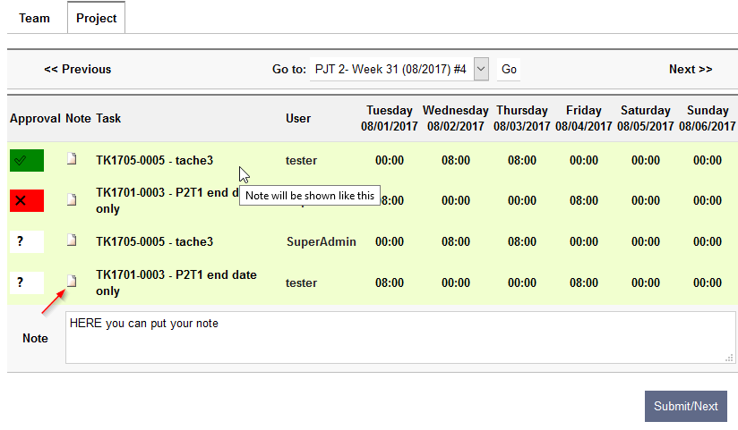
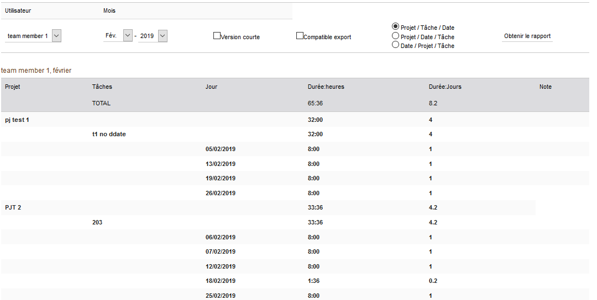

Approval:
=========

There is two types of approvals; the team approval and the “other”
approval, the difference is that the team approval shows all the tasks
for a week and for one user when the other approval shows only the task
that concern the approver ( ie. a project leader should only see the
time spent on his projects not on the others.)

The timesheet module approval feature takes the assumption that the team
leader is the responsible for the team resources management therefore
only the team manager can send back the timesheet to the user.

In order to have access to approve his subordinate’s timesheets one
should have the timesheet approver rights

-  .. rubric:: Timesheets rights
      :name: timesheets-rights

|image16|

ApprovalAdmin can access approvals and favourites for all.

ExportRead enable the access to all files (pdf) generated by the module

TeamApprover enable the user to approve the timesheet of his
subordinates.

AttendanceUser has access to the attendance page

AttendanceAdmin has access to attendance admin page

-  .. rubric:: Timesheet approval: team leader
      :name: timesheet-approval-team-leader

The team approval screen can show the timesheet grouped per user, per
week or per user/month, the maximum number of timesheets shown per page
can be set in the module setup page.

Eg: timesheet per month.

|image17|

Timesheet approval: other

|image18|\ The other approvals are showed by week, the number of item to
approve is indicated by the ‘#’ in the drop down list.

The approval is done by line by clicking on the\ |image19|

-  |image20|\ means no change,

-  |image21| means approved

-  |image22|\ and mean rejected.

Note section will appear when the user will click on the icon in the
note column, when a note is saved it will appear as an info as shown in
the screenshot.

User report

A limited report by user is available by month (in timesheet main tab),
several layouts are possible, if both short and export friendly are
chosen then the export friendly will be shown.

Note: the search ribbon appears in every layout but only the normal
layout screenshot shows it.

-  .. rubric:: User report: Normal layout:
      :name: user-report-normal-layout

|image23|

-  .. rubric:: User report: Export friendly layout
      :name: user-report-export-friendly-layout

|image24|

-  .. rubric:: User report: Short layout
      :name: user-report-short-layout

|image25|

.. |image16| image:: img/image17.png
   :width: 2.91667in
   :height: 1.10657in
.. |image17| image:: img/image18.png
   :width: 6.26806in
   :height: 6.65833in

.. |image19| image:: img/image20.png
   :width: 0.29861in
   :height: 0.19375in
.. |image20| image:: img/image20.png
   :width: 0.29861in
   :height: 0.19375in
.. |image21| image:: img/image21.png
   :width: 0.25833in
   :height: 0.17014in
.. |image22| image:: img/image22.png
   :width: 0.33611in
   :height: 0.18056in

.. |image24| image:: img/image24.png
   :width: 6.26806in
   :height: 1.60972in
.. |image25| image:: img/image25.png
   :width: 6.26806in
   :height: 1.12361in