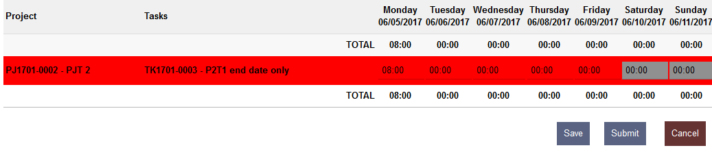
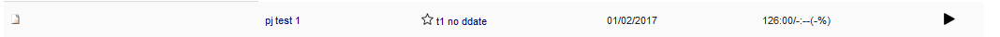

Entering time spent 
===================

Timesheet user right is required to have access to timesheet

The default page of the timesheet main menu is the user screen to log
the time spent on task (can be change to the chrono page in the setup).
The screenshot was taken with the favourite, approval flow & note per
day and note activated

-  .. rubric:: Blank/draft/saved timesheet:
      :name: blankdraftsaved-timesheet

This screen id shown when no timesheet where submitted for approval, if
there is already time saved, the time will be on a light green
background (not configurable) and the day/task that are not eligible for
time spend are on a grey background (not configurable) and are not
editable

|image5|\ Once filled in the timesheet can be save (the same layout will
be used) and modified later or submitted for approval if the approval is
set in the module configuration

the start is used to show and (un)set favourite by one click

Notes:
------

There is 3 level of notes:

-  User timesheet notes are per timesheet pages: might be useful for the
   team approver, those are the note in the bottom of the timesheet
   pages

-  Task user timesheet note are per task line and per timesheet page:
   might be useful for the project approver, those are the note at the
   beginning of a line. Once open a modal box will open.

-  Day notes are per day and task, those are saved in the core table:
   might be useful for the customer because they can be present on the
   attendance sheet, those are next to the time entry box

-  .. rubric:: Submitted timesheet
      :name: submitted-timesheet

|image6|

Once submitted, only the task with time spent entered when it was
“submitted “will be shown, the colour of the line background enables to
have a quick idea of the timesheet status (colours can be changed in the
module config page).

The timesheet will also appear in the “timesheet to approve” of his
managers ( N+1 & N+2 based on Dolibarr organization chart, the manager
should also have the approver right
Admin>User>Rights>timesheet>Approver)

The user can recall his timesheet to make change until the timesheet is
approved

When the timesheet is under approval (eg. project approval activated),
the user can no longer recall it but the layout & colour will remain the
same.

-  .. rubric:: Timesheet approved
      :name: timesheet-approved

|image7|

Once the timesheet is approved, the user can’t recall it anymore but he
can still see what was approved (colours can be changed in the module
config page). If for some reason the timesheet should be modified then
it should be set back to draft via the timesheet admin view

-  .. rubric:: Timesheet rejected
      :name: timesheet-rejected

|image8|\ The timesheet appears redetected (editable) only when the team
leader will have rejected the timesheet, when a timesheet is challenged
in the approval flow, it is sent back to the previous approval until the
team leader rejected it (cf. challenged timesheet)

-  .. rubric:: Timesheet challenged
      :name: timesheet-challenged

|image9|\ During the approval flow a task of a timesheet could be
challenged (eg. by the project lead) but the timesheet won’t be rejected
directly, the decision remains on the team leader hand, the timesheet
will appear again in the “timesheet to approved” and he could contact
the project leader for more details.

Chronos page
============

This page needs a special right attendance/chrono user right

This page aims to enable user to launch chrono to the task on which they
are currently working.

|image10|

the chrono could be started by clicking on the arrow next to the task

|image11|

Then the task details will be shown on the chrono

|image12|

The chrono can be stop by clicking on the square next to the chrono or
next to the task, starting the chrono for another task will
automatically stop the running chrono for the user.

Once the chrono is stop the task and the time are added on the timespent
for the day and task

|image13|

.. |image5| image:: img/image6.png
   :width: 6.26806in
   :height: 2.39653in
.. |image6| image:: img/image7.png
   :width: 6.26806in
   :height: 1.83125in
.. |image7| image:: img/image8.png
   :width: 6.26806in
   :height: 1.57222in

.. |image9| image:: img/image10.png
   :width: 6.26806in
   :height: 1.62222in
.. |image10| image:: img/image11.png
   :width: 6.26806in
   :height: 0.65347in

.. |image12| image:: img/image13.png
   :width: 6.26806in
   :height: 0.82917in
.. |image13| image:: img/image14.png
   :width: 6.26806in
   :height: 0.68681in